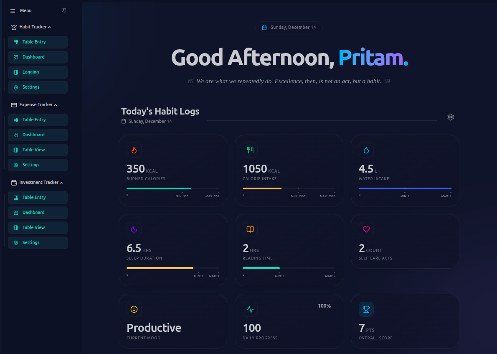
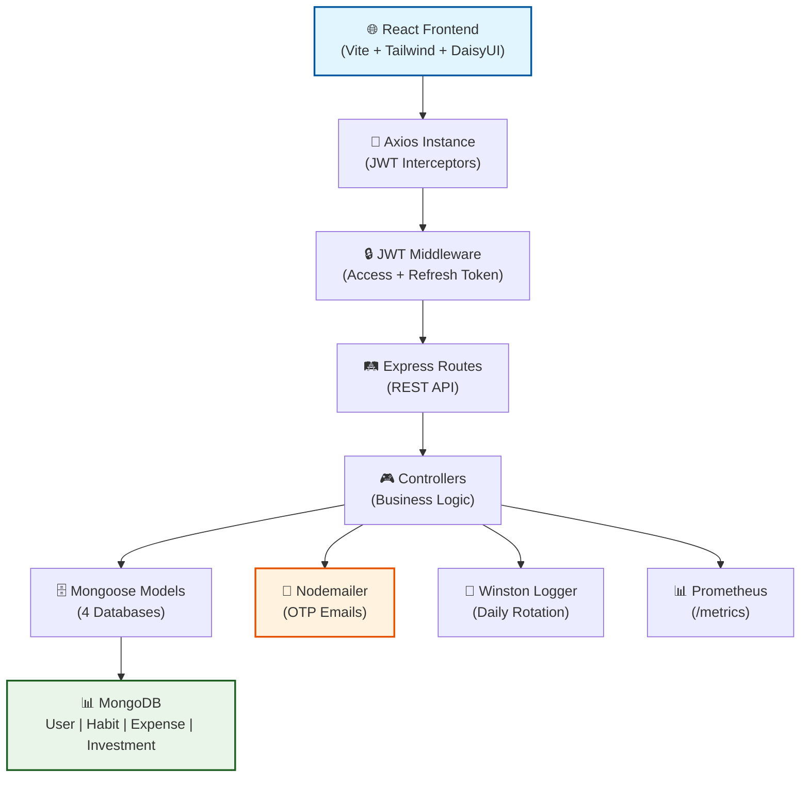
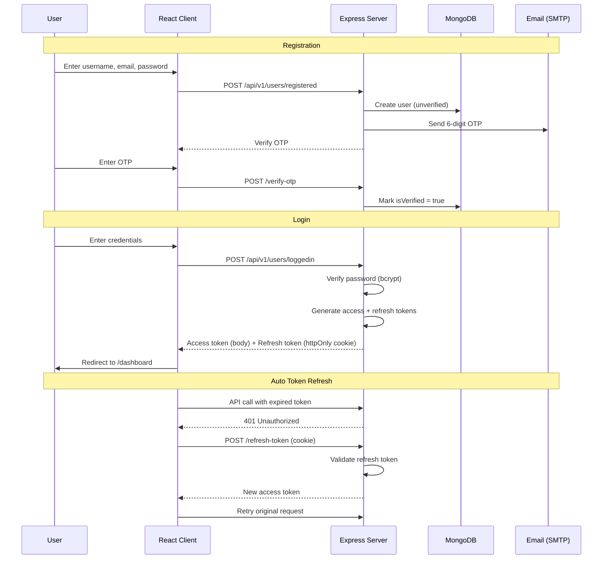

# 📊 Progress Pulse

<div align="center">



**A Modern Full-Stack Personal Productivity & Finance Management Platform**

[](https://reactjs.org/)
[](https://nodejs.org/)
[](https://www.mongodb.com/)
[](https://www.docker.com/)
[](./LICENSE)

</div>

---

## 🚀 Overview

**Progress Pulse** is a comprehensive personal productivity and finance management platform that helps users track their daily habits, manage expenses, and monitor investments — all in one place. Built with the MERN stack, it features JWT-based authentication, 14+ DaisyUI themes, a detailed food nutrition database, and full Docker-based deployment with CI/CD.

### ✨ Key Highlights

🎯 **Habit Tracking** — Calorie, water, sleep, reading, mood, self-care & food logging with nutrition breakdowns
💰 **Expense Management** — Categories, subcategories, payment sources, transfers & 5-step undo/redo
📈 **Investment Portfolio** — Stocks, Mutual Funds, Fixed Deposits & Recurring Deposits with group management
🔐 **Secure Authentication** — Dual JWT (access + refresh tokens) with OTP email verification
🎨 **14+ Themes** — DaisyUI themes with persistent selection (dark, retro, dracula, night, coffee, and more)
🍎 **Food Nutrition DB** — 46+ nutritional columns per food item with text search
🐳 **Production Ready** — Docker, Nginx, Jenkins CI/CD & Prometheus monitoring

---

## 🏗️ Architecture

Progress Pulse follows a **MERN Stack** architecture with four isolated MongoDB databases accessed through a single connection:


```mermaid
flowchart TD
    A["🌐 React Frontend<br/>(Vite + Tailwind + DaisyUI)"] --> B["🔄 Axios Instance<br/>(JWT Interceptors)"]
    B --> C["🔒 JWT Middleware<br/>(Access + Refresh Token)"]
    C --> D["🛤️ Express Routes<br/>(REST API)"]
    D --> E["🎮 Controllers<br/>(Business Logic)"]
    E --> F["🗄️ Mongoose Models<br/>(4 Databases)"]
    F --> G["📊 MongoDB<br/>User | Habit | Expense | Investment"]

    E --> K["📧 Nodemailer<br/>(OTP Emails)"]
    E --> L["📝 Winston Logger<br/>(Daily Rotation)"]
    E --> M["📊 Prometheus<br/>(/metrics)"]

    style A fill:#e1f5fe,stroke:#01579b,stroke-width:2px
    style G fill:#e8f5e8,stroke:#1b5e20,stroke-width:2px
    style K fill:#fff3e0,stroke:#e65100,stroke-width:2px
```

### 📁 Project Structure

```
Progress-Pulse/
├── Client/                          # React 19 + Vite 6 Frontend
│   ├── src/
│   │   ├── components/
│   │   │   ├── Authentication/      # Login, Signup, OTP, Forgot Password
│   │   │   ├── Dashboard/
│   │   │   │   ├── Habit/           # 60+ components (tracking, charts, food logging, analysis)
│   │   │   │   ├── Expense/         # Categories, transactions, charts, quick calculator
│   │   │   │   └── Investment/      # Stocks, MF, FD, RD cards, modals, groups
│   │   │   └── Homepage/            # Landing page (Banner, What, Why, How)
│   │   ├── Context/                 # JwtAuthContext, AxiosInstance, LoadingContext
│   │   ├── pages/                   # Route-level page components
│   │   ├── services/redux/          # Redux Toolkit store (habit + expense slices)
│   │   ├── layouts/                 # Layout, DashboardLayout, Habit/Expense/InvestmentLayout
│   │   └── utils/                   # ThemeSwitches, Alerts, Icons, mathExpression
│   └── public/                      # Screenshots, video, favicons, PWA assets
│
├── Server/                          # Express 4.21 + Mongoose 8.12 Backend
│   ├── src/
│   │   ├── controllers/             # User, Habit, Expense, Investment controllers
│   │   ├── models/                  # 17 Mongoose models across 4 databases
│   │   ├── middlewares/             # JWT auth, OTP generation/verification, refresh tokens
│   │   ├── routes/                  # REST API route definitions
│   │   ├── db/                      # Multi-database MongoDB connection
│   │   └── utils/                   # ApiError, ApiResponse, asyncHandler, Logging, seedFoodDatabase
│   └── .env                         # Environment configuration
│
├── DevOps/
│   ├── 00.CICD/                     # Jenkins pipeline
│   ├── 01.Build/
│   │   ├── Development/             # Dev docker-compose (Node 18)
│   │   └── Production/              # Prod docker-compose (Nginx + Node 18)
│   ├── 02.Test/                     # Test environment
│   └── 05.Monitoring/               # Prometheus setup
│
├── Scripts/                         # Utility scripts (backup, data population, food upload)
└── bin/                             # Food CSV database, import scripts, drafts
```

---

## 💼 Technology Stack

### Frontend

| Technology | Version | Purpose |
|---|---|---|
| React | 19.0.0 | UI Framework |
| Vite | 6.2.0 | Build Tool & Dev Server |
| Tailwind CSS | 4.0.14 | Utility-First CSS |
| DaisyUI | 5.0.6 | Component Library (14+ themes) |
| Material UI | 7.0.1 | Additional Components |
| Ant Design | 5.24.4 | UI Components |
| Redux Toolkit | 2.8.1 | State Management |
| React Router | 7.3.0 | Client-side Routing |
| Axios | 1.8.4 | HTTP Client |
| ApexCharts | 4.7.0 | Radial, Heatmap & Mixed Charts |
| Recharts | 2.15.2 | Line/Area Charts |
| Framer Motion | 12.9.2 | Animations |
| Spline | 4.0.0 | 3D Animations |
| Day.js | 1.11.13 | Date Manipulation |

### Backend

| Technology | Version | Purpose |
|---|---|---|
| Node.js | 18+ | Runtime |
| Express.js | 4.21.2 | Web Framework |
| Mongoose | 8.12.1 | MongoDB ODM |
| JSON Web Token | 9.0.2 | Authentication |
| bcryptjs | 3.0.2 | Password Hashing |
| Nodemailer | 7.0.11 | OTP Email Service |
| Winston | 3.17.0 | Logging (daily rotation) |
| prom-client | 15.1.3 | Prometheus Metrics |
| xlsx | 0.18.5 | Excel Export |
| cookie-parser | 1.4.7 | Cookie Handling |

### DevOps & Infrastructure

| Technology | Purpose |
|---|---|
| Docker + Docker Compose | Containerization |
| Nginx | Reverse Proxy & Static Serving |
| Jenkins | CI/CD Pipeline |
| Prometheus | Metrics Monitoring |
| MongoDB 7 | Database |

---

## 🔐 Authentication System

Progress Pulse uses a **dual JWT token** architecture:

- **Access Token** — 15-minute lifetime, stored in `localStorage`, sent via `Authorization: Bearer` header
- **Refresh Token** — 7-day lifetime, stored in `httpOnly` cookie (XSS-resistant)
- **Auto-refresh** — Axios interceptors automatically renew expired access tokens without user intervention


```mermaid
sequenceDiagram
    participant U as User
    participant C as React Client
    participant S as Express Server
    participant DB as MongoDB
    participant E as Email (SMTP)

    Note over U,E: Registration
    U->>C: Enter username, email, password
    C->>S: POST /api/v1/users/registered
    S->>DB: Create user (unverified)
    S->>E: Send 6-digit OTP
    S-->>C: Verify OTP
    U->>C: Enter OTP
    C->>S: POST /verify-otp
    S->>DB: Mark isVerified = true

    Note over U,E: Login
    U->>C: Enter credentials
    C->>S: POST /api/v1/users/loggedin
    S->>S: Verify password (bcrypt)
    S->>S: Generate access + refresh tokens
    S-->>C: Access token (body) + Refresh token (httpOnly cookie)
    C->>U: Redirect to /dashboard

    Note over U,E: Auto Token Refresh
    C->>S: API call with expired token
    S-->>C: 401 Unauthorized
    C->>S: POST /refresh-token (cookie)
    S->>S: Validate refresh token
    S-->>C: New access token
    C->>S: Retry original request
```

---

## 📊 Feature Modules

### 🎯 Habit Tracking

A comprehensive daily habit tracker with food nutrition logging:

| Feature | Description |
|---|---|
| **Daily Entry Table** | Log burned calories, water intake, sleep hours, reading minutes, intake calories, mood & self-care |
| **Food Logging** | Search a 46-nutrient food database, log meals by type (Breakfast/Lunch/Dinner/Snacks), track macros |
| **Calorie Dashboard** | Calorie chart, nutrient breakdown, macro overview, food item details |
| **Water Dashboard** | Water intake tracking with visual charts and score cards |
| **Sleep Dashboard** | Sleep quality monitoring and analysis |
| **Reading Dashboard** | Reading time tracking and streak visualization |
| **Mood & Journal** | Daily mood selection with journal entries and calendar view |
| **Self-Care Tracking** | Custom self-care habits with completion tracking |
| **Physical Logs** | Track weight, height, BMI over time |
| **Score System** | Daily habit score (0-7) with consistency status and progress % |
| **Streak Tracking** | Current streak, longest streak, and goal progress |
| **Export** | Export habit and food data via email |
| **Customizable Settings** | Set min/max ranges for all habits, manage mood lists, self-care items |

### 💰 Expense Management

Full-featured personal finance tracker:

| Feature | Description |
|---|---|
| **Categories & Subcategories** | Hierarchical expense categories with monthly budgets and custom colors |
| **Payment Sources** | Bank accounts, wallets, and credit cards with balance/limit tracking |
| **Transactions** | Credit, Debit, and Transfer types with description, source, category, and amount |
| **Monthly Salary** | Track salary per month with net savings calculation |
| **Copy Previous Month** | Clone categories from the previous month for quick setup |
| **Reorder** | Drag-to-reorder categories and subcategories |
| **Undo/Redo** | 5-step undo/redo stack for all transaction operations (add, edit, delete) |
| **Quick Calculator** | Built-in calculator for quick expense math |
| **Line Charts** | Spending trend visualizations |
| **Table View** | Sortable transaction table with date range filtering |
| **Bank Balances Modal** | Overview of all payment source balances |
| **Card Due Tracking** | Credit card due amount calculations |

### 📈 Investment Portfolio

Track four types of investments with detailed analytics:

#### Stocks
- Buy/sell tracking with brokerage, STT, and net calculations
- Support for Delivery & Intraday across NSE/BSE
- Large/Mid/Small cap classification
- Gain/loss calculation (Rs and %)

#### Mutual Funds
- SIP, Lumpsum, SWP, Redemption & Withdrawal transaction types
- NAV-based unit tracking with expense ratio
- Fund groups for organization
- Folio number and AMC tracking
- Direct/Regular plan, Growth option

#### Fixed Deposits
- Interest rate, tenure, compounding frequency tracking
- Maturity amount calculation
- Withdrawal handling with penalty and realized gain/loss
- Status: Active / Matured / Withdrawn / Closed
- FD groups for organization

#### Recurring Deposits
- Monthly installment tracking with transaction history
- Withdrawal settlement with profit/loss calculation
- RD groups for organization

**All investment types support**: privacy mode (hide numbers), organized groups, detailed info modals with timeline and cumulative metrics.

---

## 🗄️ Database Architecture

Four isolated MongoDB databases accessed via `mongoose.connection.useDb()`:

```
MongoDB Instance
├── User Database
│   └── RegisteredUsers          # username, email, passwordHash, OTP, isVerified
│
├── Habit-Tracker Database
│   ├── HabitTracker             # Daily habits (burned, water, sleep, read, intake, mood, journal)
│   ├── HabitSettings            # User preferences, ranges, mood list, self-care items
│   ├── PhysicalLog              # Weight, height, BMI records
│   ├── FoodDatabase             # 46+ nutritional columns per food item (text-indexed)
│   └── FoodLog                  # Daily food logs by meal type
│
├── Expense-Tracker Database
│   ├── ExpenseCategory          # Categories with embedded subcategories, budgets, colors
│   ├── ExpenseTransaction       # Credit/Debit/Transfer transactions
│   ├── MonthlyBudget            # Monthly salary records
│   └── PaymentSource            # Bank/Wallet/Card with balance and limit
│
└── Investment-Tracker Database
    ├── StockTrade               # Buy/sell with brokerage and gain calculations
    ├── MutualFund               # Transactions (SIP/Lumpsum/SWP/Redemption/Withdrawal)
    ├── MutualFundGroup          # User-defined fund groupings
    ├── FixedDeposit             # FD details with withdrawal handling
    ├── FixedDepositGroup        # User-defined FD groupings
    ├── RecurringDeposit         # RD with installment transactions
    └── RecurringDepositGroup    # User-defined RD groupings
```

---

## 📡 API Reference

### Authentication (Public)

| Method | Endpoint | Description |
|---|---|---|
| `POST` | `/api/v1/users/registered` | Register new user |
| `POST` | `/api/v1/users/registered/verify-otp` | Verify registration OTP |
| `POST` | `/api/v1/users/registered/resend-otp` | Resend registration OTP |
| `POST` | `/api/v1/users/loggedin` | Login |
| `POST` | `/api/v1/users/loggedin/refresh-token` | Refresh access token (httpOnly cookie) |
| `POST` | `/api/v1/users/loggedin/generate-otp` | Generate OTP for existing user |
| `POST` | `/api/v1/users/logout` | Logout |
| `POST` | `/api/v1/users/forgot-password-verification` | Request password reset OTP |
| `POST` | `/api/v1/users/forgot-password-verification/verify-otp` | Verify reset OTP |
| `POST` | `/api/v1/users/forgot-password-verification/reset-password` | Set new password |

### Dashboard (Protected)

| Method | Endpoint | Description |
|---|---|---|
| `GET` | `/api/v1/dashboard/auto-login` | Validate token & return user data |
| `GET` | `/api/v1/dashboard` | Get dashboard summary |

### Habit Tracker (Protected)

| Method | Endpoint | Description |
|---|---|---|
| `GET` | `/api/v1/dashboard/habit/table-entry` | Get habit entries |
| `POST` | `/api/v1/dashboard/habit/table-entry` | Create habit entry |
| `PUT` | `/api/v1/dashboard/habit/table-entry/:id` | Update habit entry |
| `DELETE` | `/api/v1/dashboard/habit/table-entry/:id` | Delete habit entry |
| `POST` | `/api/v1/dashboard/habit/table-entry/sync-intake` | Sync calorie intake with food logs |
| `GET` | `/api/v1/dashboard/habit/settings` | Get habit settings |
| `PUT` | `/api/v1/dashboard/habit/settings` | Update habit settings |
| `DELETE` | `/api/v1/dashboard/habit/settings` | Reset habit settings |
| `GET` | `/api/v1/dashboard/habit/logging` | Get physical logs |
| `POST` | `/api/v1/dashboard/habit/logging` | Add physical log |
| `DELETE` | `/api/v1/dashboard/habit/logging/:logId` | Delete physical log |
| `POST` | `/api/v1/dashboard/habit/export` | Export habit data via email |
| `GET` | `/api/v1/dashboard/habit/food/database` | Search food database |
| `POST` | `/api/v1/dashboard/habit/food/database` | Create custom food item |
| `GET` | `/api/v1/dashboard/habit/food/log` | Get daily food logs |
| `POST` | `/api/v1/dashboard/habit/food/log` | Add food log entry |
| `GET` | `/api/v1/dashboard/habit/food/range-logs` | Get food logs for date range |
| `PUT` | `/api/v1/dashboard/habit/food/log/:id` | Update food log |
| `DELETE` | `/api/v1/dashboard/habit/food/log/:id` | Delete food log |
| `DELETE` | `/api/v1/dashboard/habit/food/meal-category` | Delete all logs for a meal type |
| `POST` | `/api/v1/dashboard/habit/food/export` | Export food data via email |

### Expense Tracker (Protected)

| Method | Endpoint | Description |
|---|---|---|
| `GET` | `/api/v1/dashboard/expense/get-all-data` | Get all expense data (supports `month`, `fromMonth`/`toMonth`, `all`) |
| `POST` | `/api/v1/dashboard/expense/salary` | Set monthly salary |
| `DELETE` | `/api/v1/dashboard/expense/salary/:month` | Delete salary for month |
| `POST` | `/api/v1/dashboard/expense/category` | Create category |
| `PATCH` | `/api/v1/dashboard/expense/category/:id` | Update category |
| `DELETE` | `/api/v1/dashboard/expense/category/:id` | Delete category |
| `PUT` | `/api/v1/dashboard/expense/category/reorder` | Reorder categories |
| `POST` | `/api/v1/dashboard/expense/category/copy-previous` | Copy categories from previous month |
| `POST` | `/api/v1/dashboard/expense/category/:id/subcategory` | Add subcategory |
| `PATCH` | `/api/v1/dashboard/expense/category/:id/subcategory/:subId` | Update subcategory |
| `DELETE` | `/api/v1/dashboard/expense/category/:id/subcategory/:subId` | Delete subcategory |
| `PUT` | `/api/v1/dashboard/expense/category/:id/subcategory/reorder` | Reorder subcategories |
| `POST` | `/api/v1/dashboard/expense/source` | Create payment source |
| `PATCH` | `/api/v1/dashboard/expense/source/:id` | Update payment source |
| `DELETE` | `/api/v1/dashboard/expense/source/:id` | Delete payment source |
| `POST` | `/api/v1/dashboard/expense/transaction` | Create transaction |
| `PATCH` | `/api/v1/dashboard/expense/transaction/:id` | Update transaction |
| `DELETE` | `/api/v1/dashboard/expense/transaction/:id` | Delete transaction |

### Investment Tracker (Protected)

| Method | Endpoint | Description |
|---|---|---|
| `GET` | `/api/v1/dashboard/investment/stocks` | Get all stock trades |
| `POST` | `/api/v1/dashboard/investment/stocks` | Add stock trade |
| `PUT` | `/api/v1/dashboard/investment/stocks/:id` | Update stock trade |
| `DELETE` | `/api/v1/dashboard/investment/stocks/:id` | Delete stock trade |
| `GET` | `/api/v1/dashboard/investment/mf` | Get all mutual funds |
| `POST` | `/api/v1/dashboard/investment/mf` | Add mutual fund |
| `PUT` | `/api/v1/dashboard/investment/mf/:id` | Update mutual fund |
| `DELETE` | `/api/v1/dashboard/investment/mf/:id` | Delete mutual fund |
| `POST` | `/api/v1/dashboard/investment/mf/:id/transactions` | Add MF transaction |
| `PUT` | `/api/v1/dashboard/investment/mf/:id/transactions/:txnId` | Update MF transaction |
| `DELETE` | `/api/v1/dashboard/investment/mf/:id/transactions/:txnId` | Delete MF transaction |
| `GET` | `/api/v1/dashboard/investment/mf-groups` | Get MF groups |
| `PUT` | `/api/v1/dashboard/investment/mf-groups` | Update MF groups |
| `GET` | `/api/v1/dashboard/investment/fd` | Get all fixed deposits |
| `POST` | `/api/v1/dashboard/investment/fd` | Add fixed deposit |
| `PUT` | `/api/v1/dashboard/investment/fd/:id` | Update fixed deposit |
| `DELETE` | `/api/v1/dashboard/investment/fd/:id` | Delete fixed deposit |
| `GET` | `/api/v1/dashboard/investment/fd-groups` | Get FD groups |
| `PUT` | `/api/v1/dashboard/investment/fd-groups` | Update FD groups |
| `GET` | `/api/v1/dashboard/investment/rd` | Get all recurring deposits |
| `POST` | `/api/v1/dashboard/investment/rd` | Add recurring deposit |
| `PUT` | `/api/v1/dashboard/investment/rd/:id` | Update recurring deposit |
| `DELETE` | `/api/v1/dashboard/investment/rd/:id` | Delete recurring deposit |
| `POST` | `/api/v1/dashboard/investment/rd/:id/transactions` | Add RD transaction |
| `PUT` | `/api/v1/dashboard/investment/rd/:id/transactions/:txnId` | Update RD transaction |
| `DELETE` | `/api/v1/dashboard/investment/rd/:id/transactions/:txnId` | Delete RD transaction |
| `GET` | `/api/v1/dashboard/investment/rd-groups` | Get RD groups |
| `PUT` | `/api/v1/dashboard/investment/rd-groups` | Update RD groups |

---

## 🚀 Getting Started

### Prerequisites

- **Node.js** v18+
- **MongoDB** 7.x (local or Docker)
- **Gmail** account with App Password (for OTP emails)

### 1. Clone & Install

```bash
git clone https://github.com/er-pritamdas/Progress-Pulse.git
cd Progress-Pulse

# Install dependencies
cd Client && npm install
cd ../Server && npm install
```

### 2. Configure Environment

Create `Server/.env`:

```env
PORT=8000
MONGO_URI=mongodb://localhost:27017/

# Database Names
USER_DB=User
HABIT_DB=Habit-Tracker
EXPENSE_DB=Expense-Tracker
INVESTMENT_DB=Investment-Tracker

# JWT Secrets (generate strong random values)
JWT_SECRET_KEY=your-access-token-secret
REFRESH_TOKEN_SECRET_KEY=your-refresh-token-secret
ACCESS_TOKEN_EXPIRY=15m
REFRESH_TOKEN_EXPIRY=7d

# Email (Gmail App Password)
EMAIL_USER=your-email@gmail.com
EMAIL_PASS=your-app-specific-password

NODE_ENV=development
```

> **Note:** The frontend proxies `/api` to `http://localhost:8000` via Vite config — no client-side `.env` needed.

### 3. Start Development

**Option A — Manual:**

```bash
# Terminal 1: Backend
cd Server
npm run dev

# Terminal 2: Frontend
cd Client
npm run dev
```

**Option B — Docker (Development):**

```bash
cd DevOps/01.Build/Development
docker-compose up --build
```

### 4. Access the App

| Service | URL |
|---|---|
| Frontend | `http://localhost:5173` |
| Backend API | `http://localhost:8000` |
| Prometheus Metrics | `http://localhost:8000/metrics` |

> The food database auto-seeds from `bin/FOOD TRACKER - Food_Database.csv` on first server start.

---

## 🐳 Deployment

### Production Docker Setup

```bash
cd DevOps/01.Build/Production
docker-compose up --build -d
```

**Production architecture:**

```
Client (Nginx:80) ──proxy /api/──> Backend (Node:3000) ──> MongoDB (27017)
      │                                    │
      └── static SPA (dist/)              └── /metrics ──> Prometheus
```

- **Nginx** serves the built React SPA with SPA fallback (`try_files`) and proxies `/api/` to the backend
- **Static assets** cached for 6 months
- **Backend** runs in production mode with `npm start`

### Jenkins CI/CD

The pipeline (`DevOps/00.CICD/jenkinsfile`) automates:

1. **Setup** — Install prerequisites, clone repo, configure `.env` from Jenkins credentials
2. **Build** — Build 4 Docker images (backend, frontend, database, prometheus), push to Docker Hub
3. **Test** — Pull built images and start the test environment

### Monitoring

Prometheus scrapes the backend `/metrics` endpoint every 5 seconds, tracking:
- Default Node.js metrics (CPU, memory, event loop)
- HTTP request duration and count

---

## 🎨 Theming

Progress Pulse includes **14+ DaisyUI themes** with persistent selection:

| Theme | Theme | Theme | Theme |
|---|---|---|---|
| 🌙 Night (default) | 🌑 Dark | 🎃 Halloween | 🌲 Forest |
| 🌊 Aqua | 🖤 Black | 🧛 Dracula | 💼 Business |
| 🌅 Sunset | 🕰️ Retro | ☕ Coffee | 🌑 Dim |
| 🌌 Abyss | 💡 Light | | |

Theme preference is saved to `localStorage` and restored on page load.

---

## 📜 Scripts

| Script | Language | Purpose |
|---|---|---|
| `Scripts/mongodb_backup.sh` | Bash | Interactive MongoDB backup with `mongodump --gzip` |
| `Scripts/SyncWithGit.sh` | Bash | Quick git add + commit + push |
| `Scripts/jenkinsInstallation.sh` | Bash | Automated Jenkins installation on Ubuntu |
| `Scripts/populateHabitEntries.py` | Python | Generate 30 days of random habit data via API |
| `Scripts/deleteHabitEntries.py` | Python | Delete habit entries for a date range |
| `Scripts/upload_food.py` | Python | Upload food items to MongoDB directly |

---

## 🤝 Contributing

1. **Fork** the repository
2. **Create** a feature branch: `git checkout -b feature/your-feature-name`
3. **Install** dependencies: `cd Client && npm install && cd ../Server && npm install`
4. **Make** your changes following the existing code style
5. **Commit** with a descriptive message: `feat(habit): add streak counter functionality`
6. **Push** and create a **Pull Request**

### Commit Convention

```
feat(scope): add new feature
fix(scope): resolve bug
docs(scope): update documentation
refactor(scope): improve code structure
```

---

## 📄 License

This project is licensed under the **MIT License** — see the [LICENSE](./LICENSE) file for details.

---

## 👤 Author

**Pritam Das** — [@er-pritamdas](https://github.com/er-pritamdas)

---

<div align="center">

**If Progress Pulse helped you stay productive, consider giving it a ⭐!**

Made with ❤️ for personal productivity

</div>
